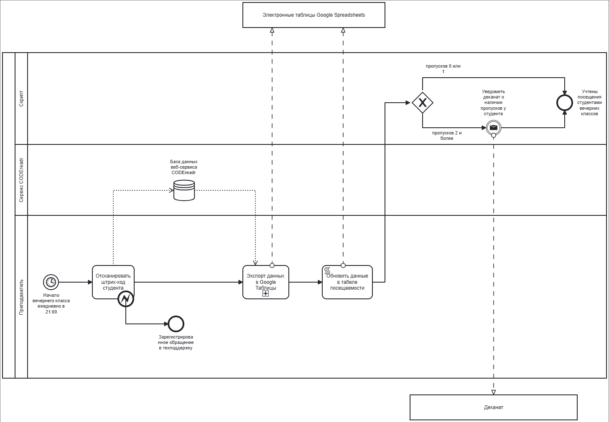
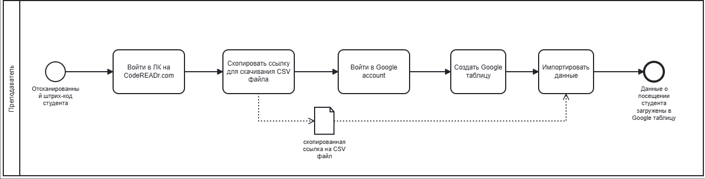

## 1. Задание

1.	Нарисуйте схему BPMN процесса TO-BE. 
Среди участников процесса должны быть: преподаватель, принимающий студентов, Сервис CODEReadr, Элеткронные таблицы Google Spreadsheets, разработанный нами скрипт (который отображает пропуски в электронной таблице и отсылает e-mail уведомления);
Кроме того, в схеме должны быть отражены такие действия как: сканирование штрих-кодов, сбор данных из CODEreadr, обновление табеля посещаемости в электронной таблице, рассылка e-mail сообщений;
2.	Подготовьте пояснительный текст к схеме, который описывает нарисованный вами процесс.

## 2. Нотации BPMN  

   
Рисунок 1 - Бизнес процесс «Отслеживание посещений»

   
Рисунок 2 - Подпроцесс «Экспорт данных в Google таблицы»

### 3.1. Описание бизнес-процесса «Отслеживание посещений»
Данный бизнес-процесс описывает планируемую автоматизацию отслеживания посещаемости студентами вечерних занятий, которые проходят ежедневно с 21:00 до 22:00. Процесс включает в себя сканирование штрих-кодов студентов при входе в класс, запись данных о посещаемости и уведомление деканата по электронной почте, если у студента есть два или более отсутствия.

#### 3.1.1 Описание функций бизнес-процесса «Отслеживание посещений»

Таблица 1 – Описание функций бизнес-процесса «Отслеживание посещений»
| Наименование функции | Отсканировать штрих-код студента | Экспорт данных в Google таблицы | Обновить данные в табеле посещаемости |
|----|----|----|----|
| **Роли пользователей, участвующих в выполнении функции** | Преподаватель, сервис CODEreadr| Преподаватель, электронные таблицы Google Spreadsheets | Преподователь, скрипт |
| **Входные данные функции** | Начало вечернего класса | Загруженные в базу веб-сервиса CODEreadr данные о посещении студента | Загруженные в Google таблицу данные о посещении студента. |
| **Описание действия** | В приложении CODEreadr преподаватель сканирует штрих-код с пропуска студента, пришедшего на занятие. Отсканированные данные автоматически загружаются в веб-сервис CODEreadr. В случае если штрих-код не отсканировался/ отсканировался с ошибкой - преподователь обращается в техподдержку. | [3.2. Описание подпроцесса «Экспорт данных в Google таблицы»](#title) | В электронной таблице Google Spreadsheets преподаватель запускает макрос, который обрабатывает загруженные данные о посещении студента из CVS файла. Обработка включает в себя добавление данных на лист в Google таблице "Табель посещаемости", отражающий список студентов, их контактные данные, даты занятий и факт их посещения. В случае если у студента насчитывается 2 и более пропусков занятий - в соответствии с макросом отправляется email-оповещение на почту декана. |
| **Выходные данные функции** | 1. Загруженные в базу веб-сервиса CODEreadr данные о посещении студента. ИЛИ 2. Зарегистрированное обращение в техподдержку. | Загруженные в Google таблицу данные о посещении студента. | 1. Актуальные данные в табеле посещяемости. И/ИЛИ 2. Отправленное email-оповещение на почту декана о наличии 2 и более пропусков у студента. |

### <a id="title">3.2. Описание подпроцесса «Экспорт данных в Google таблицы»</a>
Данный бизнес-процесс описывает выгрузку данных с веб-сервиса CODEreadr в Google Spreadsheets. Процесс включает в себя сканирование ссылки на CVS файл, содержащий данные о посещении студентами вечерних занятий, и вставку этих данных в новую Google таблицу через специальную формулу, используя отсканированную ссылку.

#### 3.2.1. Описание функций подпроцесса «Экспорт данных в Google таблицы»

Таблица 2 – Описание функций подпроцесса «Экспорт данных в Google таблицы»
| Наименование функции | Войти в ЛК на CodeREADr.com | Скопировать ссылку для скачивания CVS файла | Войти в Google account | Создать Google таблицу | Импортировать данные |
|----|----|----|----|----|----|
| **Роли пользователей, участвующих в выполнении функции** | Преподаватель | Преподаватель | Преподаватель | Преподаватель | Преподаватель |
| **Входные данные функции** | Отсканированный штрих-код студента | Выполненный вход на веб-сайт CodeREADr.com | Скоппированная ссылка для скачиватия CVS файла | Выполненный вход в Google account | Новая Google таблица |
| **Описание действия** | Преподаватель заходит на веб-сайт CodeREADr.com, нажимает кнопку "Sign In", вводит свои почту и пароль. | На веб-сайте CodeREADr.com преподаватель копирует ссылку для скачивания CVS файла. | Преподаватель заходит на сайт accounts.google.com, нажимает кнопку "Sign In", вводит свои почту и пароль. | Преподаватель в Google account создает Google таблицу. | Преподаватель загружает данные в Google таблицу по ссылке для скачивания CVS файла через функцию =IMPORTDATA("CSV_DOWNLOAD_LINK") |
| **Выходные данные функции** | Выполненный вход на веб-сайт CodeREADr.com | Скоппированная ссылка для скачиватия CVS файла | Выполненный вход в Google account | Новая Google таблица | Загруженные в Google таблицу данные о посещении студента  |
