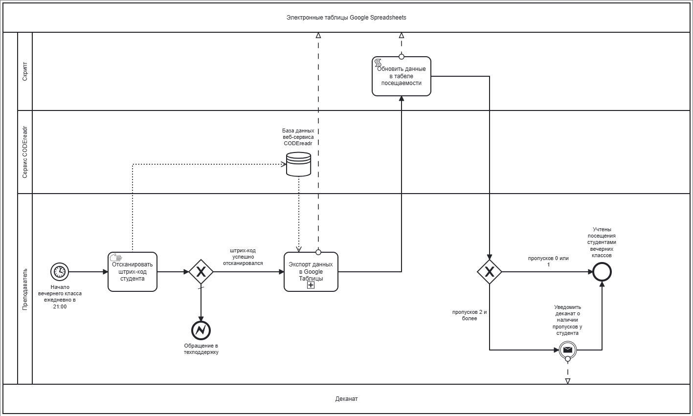
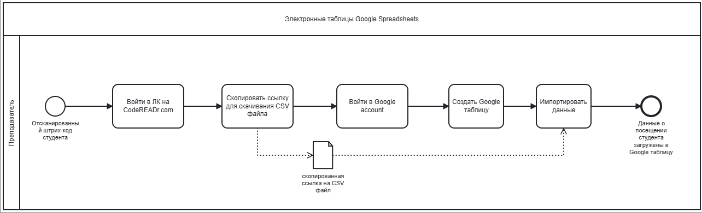

## 1. ВВЕДЕНИЕ

## 2. Нотации BPMN  

   
Рисунок 1 - Бизнес процесс «Отслеживание посещений»

   
Рисунок 2 - Подпроцесс «Экспорт данных в Google таблицы»

## 3.	Описание бизнес-процесса «Отслеживание посещений»
*[Текстовое описание технологии выполнения процесса, написанное естественным языком. Описание вкратце должно дать понятие, как выполняется бизнес-процесс.]*

### 3.1. Описание подпроцесса «Экспорт данных в Google таблицы»

### 3.2	Описание функций бизнес-процесса 

Таблица 1 – Описание функций бизнес-процесса «Отслеживание посещений»
| Наименование функции | *[Наименование функции]* |
|----|----|
| **Роли пользователей, участвующих в выполнении функции** | *[Все роли, участвующие в выполнении функции. При необходимости может указываться степень ответственности для каждой роли]* |
| **Входные данные функции** | *[Информация, поступающая на вход выполнения функции]* |
| **Описание действия** | *[Порядок действий при выполнении функции. Необходимые условия. Начальное и конечное событие функции]* |
| **Выходные данные функции** | *[Выходная информация, получающаяся в результате выполнения функции]* |   

Таблица 2 – Описание функций подпроцесса «Экспорт данных в Google таблицы»
| Наименование функции | *[Наименование функции]* |
|----|----|
| **Роли пользователей, участвующих в выполнении функции** | *[Все роли, участвующие в выполнении функции. При необходимости может указываться степень ответственности для каждой роли]* |
| **Входные данные функции** | *[Информация, поступающая на вход выполнения функции]* |
| **Описание действия** | *[Порядок действий при выполнении функции. Необходимые условия. Начальное и конечное событие функции]* |
| **Выходные данные функции** | *[Выходная информация, получающаяся в результате выполнения функции]* |