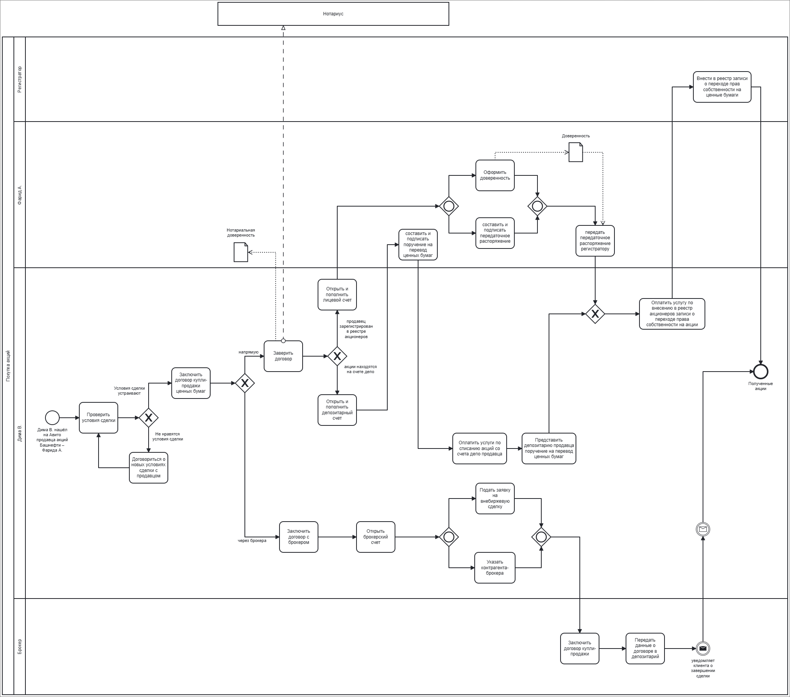

## 1. Задание

1.	Опишите с помощью BPMN 2.0 весь процесс - от покупки акций у Фарида до продажи их на Московской бирже.

## 2. Нотации BPMN  

   
Рисунок 1 - Бизнес процесс «Покупка акций у Фарида»

   
Рисунок 1 - Бизнес процесс «Продажа акций на Московской бирже»

Источники:
- https://www.banki.ru/news/daytheme/?id=10963407
- https://www.law.ru/article/21156-qqq-16-m11-25-11-2016-kak-registriruetsya-perehod-prava-na-aktsii-pao-pri-ih-prodaje?ysclid=m2kc9ppe6k322860178
- http://www.consultant.ru/document/cons_doc_LAW_10148/
- http://www.consultant.ru/document/cons_doc_LAW_5142/
- https://www.moex.com/a8054?ysclid=m2lehdiobb27593471