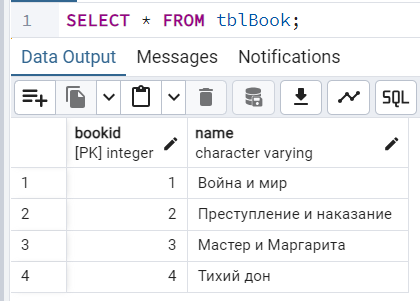
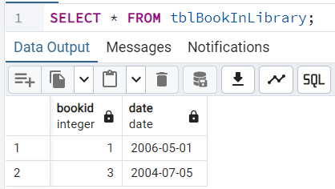
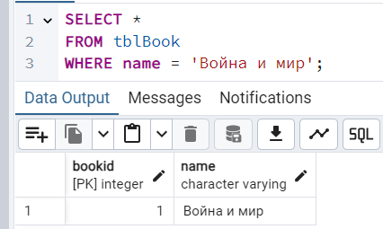
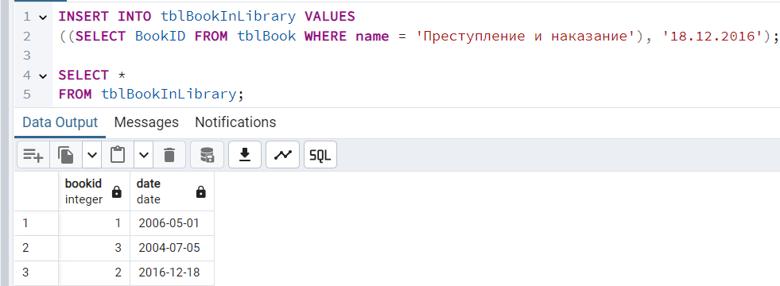
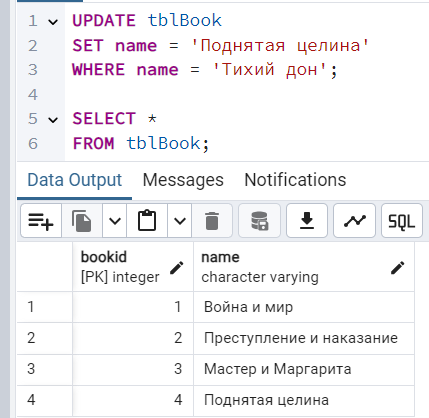
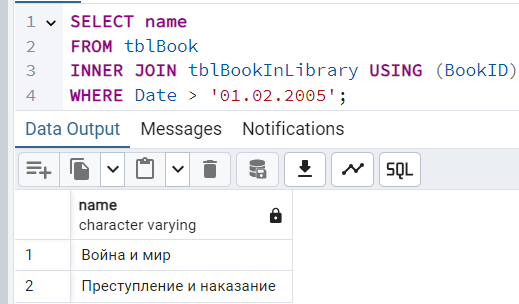
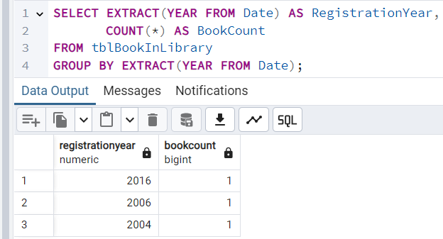

## 1. SQL запросы

Создание таблиц для работы:



```
CREATE TABLE tblBook (
    BookID INT PRIMARY KEY,
    Name VARCHAR NOT NULL);
	
INSERT INTO tblBook (BookID, Name) VALUES
(1, 'Война и мир'),
(2, 'Преступление и наказание'),
(3, 'Мастер и Маргарита'),
(4, 'Тихий дон');
```


```
CREATE TABLE tblBookInLibrary (
    BookID INT,
    Date DATE,
    FOREIGN KEY (BookID) REFERENCES tblBook(BookID));

INSERT INTO tblBookInLibrary (BookID, Date) VALUES
(1, '2006-05-01'),
(3, '2004-07-05');
```

1) Написать запрос, показывающий книгу Война и Мир:

       
    ```
    SELECT * 
    FROM tblBook
    WHERE name = 'Война и мир';
    ```
2) Добавить дату регистрации для книги «Преступление и наказание», равную 18 декабря 2016 года.

    
    ```
    INSERT INTO tblBookInLibrary VALUES 
    ((SELECT BookID FROM tblBook WHERE name = 'Преступление и наказание'), '18.12.2016');
    ```
3) Изменить название книги «Тихий дон» на «Поднятая целина».

    
    ```
    UPDATE tblBook 
    SET name = 'Поднятая целина' 
    WHERE name = 'Тихий дон';
    ```
4) Выбрать все книги и отобразить их названия, у которых дата регистрации больше  01.02.2005.

    
    ```
    SELECT name
    FROM tblBook 
    INNER JOIN tblBookInLibrary USING (BookID)
    WHERE Date > '01.02.2005';
    ```
5) Отобразите года регистрации книг и количество книг, зарегистрированных в каждом году.

    
    ```
    SELECT EXTRACT(YEAR FROM Date) AS RegistrationYear, 
	   COUNT(*) AS BookCount
    FROM tblBookInLibrary
    GROUP BY EXTRACT(YEAR FROM Date);
    ```


