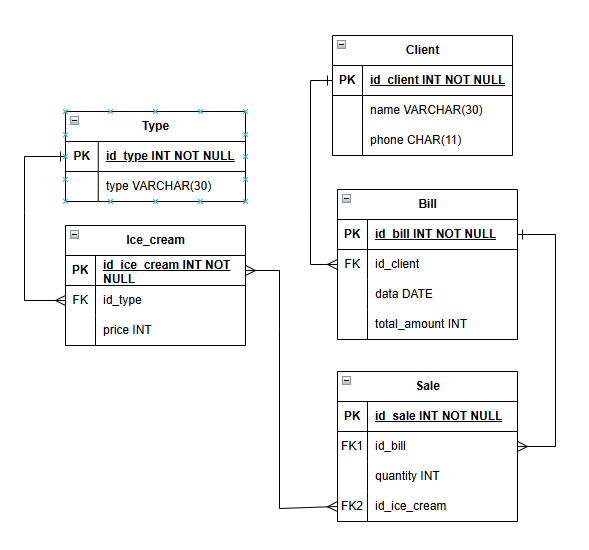
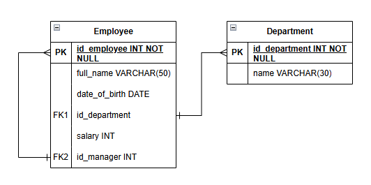

## 1. ER-диаграммы

   
Рисунок 1 - База данных для учета продаж мороженного клиентам

Таблица 1 - Связи в базе данных для учета продаж мороженного клиентам
| Связь | Тип | Коммаентарий |
|----|----|----|
| Тип и мороженное | Один ко многим | Тип может включать множество различных видов мороженого, но каждое конкретное мороженое будет принадлежать только одному типу. |
| Мороженное и продажа | Многие ко многим | Одно мороженое может быть продано в рамках множества продаж, и одна продажа может включать несколько различных видов мороженого. |
| Продажа и чек | Один ко многим | Один чек может включать много продаж, но одна продажа будет принадлежать одному чеку. |
| Чек и клиент | Один ко многим |  Один клиент может иметь множество чеков, но каждый чек будет принадлежать только одному клиенту. |   

   
Рисунок 2 - База данных для хранения Сотрудников и Отделов, к которым они принадлежат

Таблица 2 - Связи в базе данных для хранения Сотрудников и Отделов
| Связь | Тип | Коммаентарий |
|----|----|----|
| Сотрудник и Департамент | Один ко многим | Один департамент может иметь много сотрудников, но каждый сотрудник принадлежит только одному департаменту. |
| Сотрудник и Руководитель | Один ко многим | Один руководитель может иметь в подчинении много сотрудников. (На диаграмме изображена рекурсивная связь, так как руководитель тоже является сотрудником. FOREIGN KEY (manager_id) REFERENCES employee(id)) |